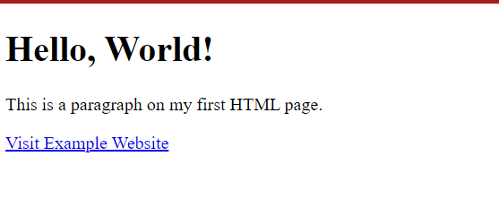
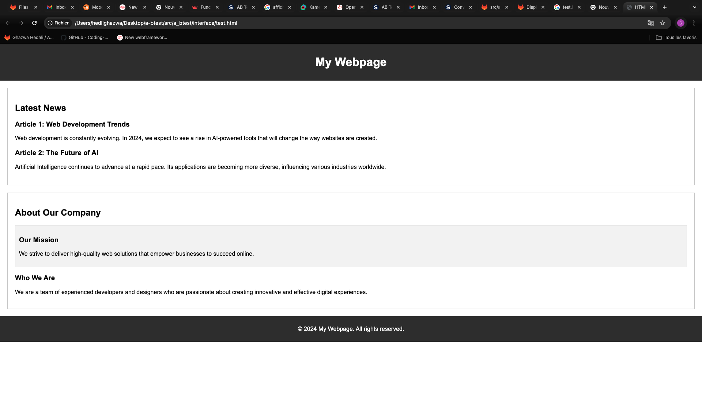

# Introduction to HTML

---

## What is HTML?

HTML (HyperText Markup Language) is the standard language used to create web pages. It structures content on the web and describes the structure of a webpage. HTML consists of a series of elements that tell the browser how to display the content.

## Key Concepts

### 1. HTML Elements
- An HTML element is defined by a start tag, content, and an end tag.
- Example:
    ```html
    <p>This is a paragraph.</p>
    ```
- In this example, `<p>` is the start tag, and `</p>` is the end tag. The content is "This is a paragraph."

### 2. HTML Tags
- Tags are used to mark the beginning and end of an HTML element. They are enclosed in angle brackets (`< >`).
- Example: `<h1>`, `<p>`, `<div>`, `<a>`

### 3. HTML Attributes
- Attributes provide additional information about an element and are always included in the opening tag.
- Example:
    ```html
    <a href="https://www.example.com">Visit Example</a>
    ```
- In this example, `href` is an attribute of the `<a>` tag, specifying the URL of the link.

### 4. HTML Document Structure
- A basic HTML document has a structure that includes a `<!DOCTYPE html>` declaration, followed by an `<html>` tag that contains two main sections: `<head>` and `<body>`.
- Example:
    ```html
    <!DOCTYPE html>
    <html>
    <head>
      <title>My First Webpage</title>
    </head>
    <body>
      <h1>Big Title            </h1>
      <h2>  subheading         </h2>
      <p> This is my first webpage.</p>
    </body>
    </html>
    ```
- **Explanation:**
  - `<!DOCTYPE html>`: Declares the document type and version of HTML.
  - `<html>`: The root element of an HTML page.
  - `<head>`: Contains metadata about the HTML document (e.g., title, links to stylesheets).
  - `<body>`: Contains the content of the webpage that will be displayed to users.

### 5. Common HTML Tags

- **Headings:** Used to define headings, ranging from `<h1>` (most important) to `<h6>` (least important).
    ```html
    <h1>This is a main heading</h1>
    <h2>This is a subheading</h2>
    ```
- **Paragraphs:** Used to define blocks of text.
    ```html
    <p>This is a paragraph of text.</p>
    ```
- **Links:** Used to create hyperlinks.
    ```html
    <a href="https://www.example.com">Click here</a>
    ```
- **Images:** Used to embed images in a webpage.
    ```html
    
    ```
- **Lists:** Used to create ordered (`<ol>`) or unordered (`<ul>`) lists.
    ```html
    <ul>
      <li>Item 1</li>
      <li>Item 2</li>
    </ul>
    ```

### 6. HTML Comments
- Comments in HTML are not displayed in the browser and are used to leave notes in the code.
- Example:
    ```html
    <!-- This is a comment -->
    ```

### 7. Basic HTML Page Example

Here's a simple example of a complete HTML page:
```html
<!DOCTYPE html>
<html>
<head>
  <title>My First HTML Page</title>
</head>
<body>
  <h1>Hello, World!</h1>
  <p>This is a paragraph on my first HTML page.</p>
  <a href="https://www.example.com">Visit Example Website</a>
</body>
</html>
```


### 8. Code Execution 




### 9. Common Tags  `<div>`, `<section>`, and `<article>`

Understanding the structure of a webpage is crucial for effective web development. HTML provides several semantic elements to help structure web content properly. Here’s a simple breakdown of three commonly used HTML elements: `<div>`, `<section>`, and `<article>`.

#### 1. `<div>`
- **What is it?** The `<div>` tag is a generic container used primarily for styling or layout purposes via CSS or JavaScript. It does not inherently represent anything specific about its content.
- **Usage:** Use `<div>` when you need a container for elements, and no other semantic element is appropriate. It’s perfect for applying CSS styles or creating page layouts.
- **Example:**
  ```html
  <div class="header">
    My Website Header
  </div>
  ```


#### 2. `<article>`

The `<article>` tag is an HTML5 element used to define independent, self-contained content within a webpage. This content should make sense on its own and could be distributed or reused independently of the rest of the page.

## Key Points:
- **Purpose:** The `<article>` tag is intended for content that can stand alone, such as a blog post, news article, forum post, or any other piece of content that could be distributed or syndicated.
- **Self-Contained:** The content inside an `<article>` should be meaningful and complete on its own. For example, if you remove the article from the rest of the website, it should still make sense.
- **Semantic Meaning:** Using the `<article>` tag helps with the semantic structure of your webpage, making it easier for search engines and other tools to understand the content of your page.

## Example:

```html
<article>
  <h2>Beginning of a context </h2>
  <p>article 
    blog post 
    news 
    reviews 
    users comments
  </p>
</article>
```
#### 3.  `<section>` Tag 

The `<section>` tag is an HTML5 element used to define sections within a webpage. It is typically used to group related content together. Unlike `<article>`, which is used for self-contained content, `<section>` is used to organize content within a document.

## Key Points:
- **Purpose:** The `<section>` tag is intended to group related content together. It often includes a heading and can be nested within other sections to create a hierarchical structure.
- **Contextual Grouping:** Content within a `<section>` should be thematically related. The tag helps to structure the webpage by dividing it into different sections, making it easier to understand and navigate.
- **Semantic Meaning:** The `<section>` tag adds semantic meaning to your HTML, helping search engines and other tools understand the structure and purpose of different parts of your webpage.

## Example:

```html
<section>
  <h2>About Us</h2>
  <p>Our company has been providing quality services for over 10 years. We are dedicated to ensuring customer satisfaction and delivering top-notch products.</p>
</section>

<section>
  <h2>Our Services</h2>
  <p>We offer a wide range of services to meet your needs, including web development, graphic design, and digital marketing.</p>
</section>
```

### 10. Code Execution with different Tags 

```html

<!DOCTYPE html>
<html lang="en">
<head>
    <meta charset="UTF-8">
    <meta name="viewport" content="width=device-width, initial-scale=1.0">
    <title>HTML Structure Example</title>
    <style>
        body {
            font-family: Arial, sans-serif;
            margin: 0;
            padding: 0;
        }
        header, footer {
            background-color: #333;
            color: white;
            text-align: center;
            padding: 10px 0;
        }
        section {
            margin: 20px;
            padding: 20px;
            border: 1px solid #ccc;
        }
        article {
            margin-bottom: 20px;
        }
        .sidebar {
            background-color: #f4f4f4;
            padding: 10px;
            border: 1px solid #ddd;
        }
    </style>
</head>
<body>

    <header>
        <h1>My Webpage</h1>
    </header>

    <section>
        <h2>Latest News</h2>
        <article>
            <h3>Article 1: Web Development Trends</h3>
            <p>Web development is constantly evolving. In 2024, we expect to see a rise in AI-powered tools that will change the way websites are created.</p>
        </article>

        <article>
            <h3>Article 2: The Future of AI</h3>
            <p>Artificial Intelligence continues to advance at a rapid pace. Its applications are becoming more diverse, influencing various industries worldwide.</p>
        </article>
    </section>

    <section>
        <h2>About Our Company</h2>
        <div class="sidebar">
            <h3>Our Mission</h3>
            <p>We strive to deliver high-quality web solutions that empower businesses to succeed online.</p>
        </div>
        <div class="main-content">
            <h3>Who We Are</h3>
            <p>We are a team of experienced developers and designers who are passionate about creating innovative and effective digital experiences.</p>
        </div>
    </section>

    <footer>
        <p>&copy; 2024 My Webpage. All rights reserved.</p>
    </footer>

</body>
</html>

```
### 11. Code Execution 



#### CSS 

CSS (Cascading Style Sheets) is a language that helps you style your HTML webpage. It allows you to change colors, fonts, spacing, and layout of your webpage.

## 1. What is CSS?

CSS stands for **Cascading Style Sheets**. It is used to style HTML elements and control how they look on a webpage.

## 2. How to Add CSS to HTML

There are three simple ways to add CSS to your HTML:

### 2.1 Inline CSS

Add CSS directly to an HTML tag using the `style` attribute.

```html
<p style="color: blue;">This is a blue paragraph.</p>

```
